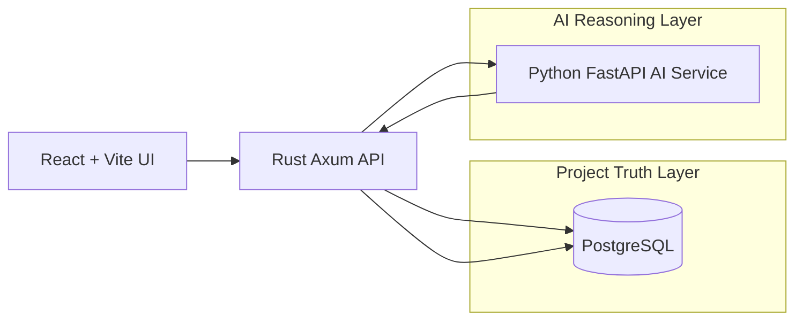

# SolarOps Truth Layer

SolarOps Truth Layer is a compact full-stack application for managing renewable-energy project operations. It tracks projects, sites, assets, milestones, incentives, financing readiness, blockers, evidence, AI-generated claims, and audit history.

The core design principle is evidence-first AI: every AI-generated operational claim must be classified as verified, assumption, missing evidence, or contradicted.



## Tech Stack

- Web: React 19, TypeScript, Vite, Tailwind CSS.
- API: Rust, Axum, SQLx, PostgreSQL.
- AI service: Python, FastAPI, Pydantic.
- Local stack: Docker Compose with PostgreSQL 16.

## Local Setup

```bash
cp .env.example .env
docker compose up --build
```

Services:

- Web: http://localhost:5173
- Rust API: http://localhost:8080
- AI service: http://localhost:8001
- PostgreSQL: localhost:5432

The Rust API runs SQLx migrations on startup. `001_init.sql` creates the schema and `002_seed.sql` loads the deterministic Project A-E demo portfolio.

The web app defaults to demo-safe fallback data if the API is unavailable. Set `VITE_ENABLE_MOCK_FALLBACK=false` to surface live API errors instead.

## Demo Workflows

1. Identify blocked projects: open `/`, filter for projects with open blockers, open a red project, and ask "What is blocking this project?"
2. Evaluate Project A financing readiness: open Project A, ask "Is this project ready for financing review?", add `rebate_award_letter`, then ask again.
3. Detect Project C data conflict: ask "Can this project move to rebate submission?" and inspect the contradicted claim.
4. Check Project D installation readiness: ask "Can installation start?" and confirm interconnection approval is missing.
5. Evaluate Project E unknown readiness: ask "Is this project financially viable?" and confirm missing utility, rebate, battery, and financing evidence is explicit.

## API Overview

- `GET /health`
- `GET /portfolio/health`
- `GET /projects`
- `GET /projects/{project_id}`
- `PATCH /projects/{project_id}/stage`
- `POST /projects/{project_id}/evidence`
- `GET /claims`
- `GET /projects/{project_id}/claims`
- `POST /projects/{project_id}/claims/{claim_id}/reverify`
- `GET /projects/{project_id}/blockers`
- `PATCH /blockers/{blocker_id}`
- `POST /projects/{project_id}/ai/ask`

Errors use:

```json
{
  "error": {
    "code": "PROJECT_NOT_FOUND",
    "message": "Project not found.",
    "details": {}
  }
}
```

## AI Claim Status Model

- `verified`: linked evidence directly supports the claim.
- `assumption`: structured data suggests the claim, but direct evidence is absent.
- `missing_evidence`: required proof is absent.
- `contradicted`: blockers or records conflict with the claim.

The Rust API downgrades AI `verified` claims that do not include evidence IDs from the current project.

## Test Commands

```bash
make test-rust
make test-ai
make test-web
make build-web
make compose-config
```

## Known Limits

- Local demo only.
- No authentication or production authorization.
- No real customer data, external integrations, file storage, OCR, or GIS.
- `AI_PROVIDER=mock` is the deterministic default.
- Docker-based full-stack startup requires a running local Docker daemon.
