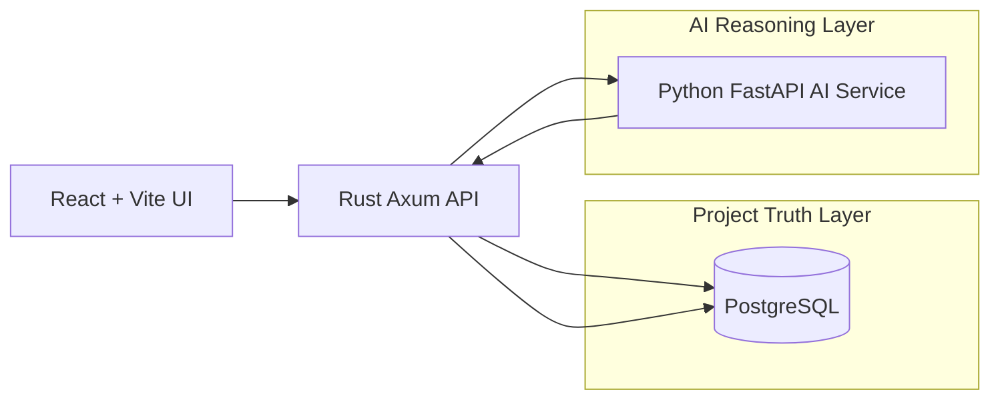

# SolarOps Truth Layer

SolarOps Truth Layer is a compact full-stack application for managing renewable-energy project operations. It tracks projects, sites, assets, milestones, incentives, financing readiness, blockers, evidence, AI-generated claims, and audit history.

The core design principle is evidence-first AI: every AI-generated operational claim must be classified as verified, assumption, missing evidence, or contradicted.



## Tech Stack

- Web: React 19, TypeScript, Vite, Tailwind CSS.
- API: Rust, Axum, SQLx, PostgreSQL.
- AI service: Python, FastAPI, Pydantic.
- Local stack: Docker Compose with PostgreSQL 16.

## Local Setup

```bash
cp .env.example .env
docker compose up --build
```

Services:

- Web: http://localhost:5173
- Rust API: http://localhost:8080
- AI service: http://localhost:8001
- PostgreSQL: localhost:5432

## Test Commands

```bash
make test-rust
make test-ai
make test-web
make build-web
```

## Known Limits

- Local demo only.
- No authentication or production authorization.
- No real customer data, external integrations, file storage, OCR, or GIS.
- `AI_PROVIDER=mock` is the deterministic default.
