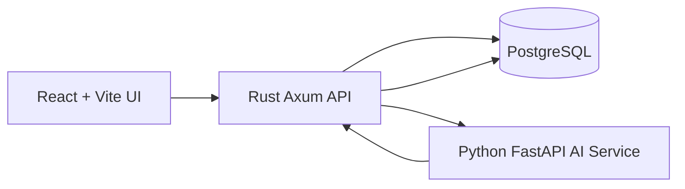

# Architecture

SolarOps Truth Layer uses a four-service local stack: React UI, Rust API, Python AI service, and PostgreSQL.

The Rust API is the system-of-record boundary. It reads project context from PostgreSQL, calls the AI service for structured suggestions, validates unsafe AI output, persists claims and AI runs, and returns normalized responses to the UI.
