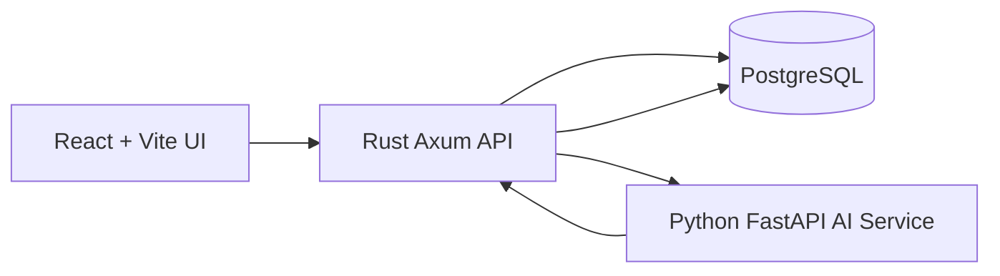

# Architecture

SolarOps Truth Layer uses a four-service local stack: React UI, Rust API, Python AI service, and PostgreSQL.



The Rust API is the system-of-record boundary. It reads project context from PostgreSQL, calls the AI service for structured suggestions, validates unsafe AI output, persists claims and AI runs, and returns normalized responses to the UI.

## Request Flow

```txt
User -> React UI -> Rust API -> PostgreSQL -> Python AI service
     -> Rust validation -> PostgreSQL claims/ai_runs -> React UI
```

## Database Role

PostgreSQL stores all project truth-layer records: organizations, sites, projects, milestones, assets, evidence, claims, claim/evidence links, blockers, activity events, and AI runs. Seed data is deterministic so tests and demos can rely on stable project behavior.

## Claim Validation Flow

1. Rust loads project detail and evidence context.
2. Python mock AI returns structured claims.
3. Rust validates evidence IDs against current project evidence.
4. Verified AI claims without valid evidence IDs become `missing_evidence`.
5. Rust persists generated claims and `ai_runs`.
